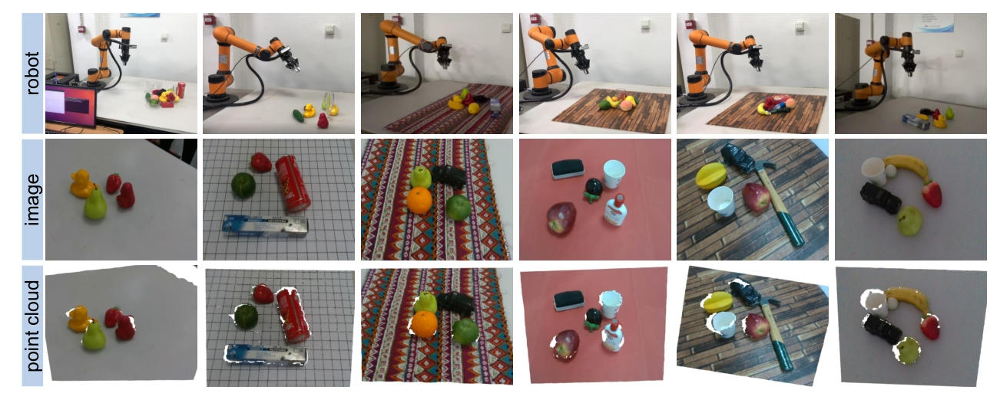

# CFS-Grasp
The MBT dataset comprises seven different backgrounds and approximately 700 RGB-D images, covering 33 object categories from the YCB dataset, the GraspNet-1Billion dataset, and common household items such as hammers, toy cars, and paper cups.

For example:

